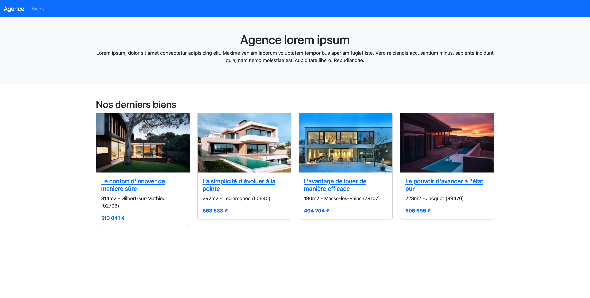

# Real Estate Agency

## Description

This is a full-stack web application designed for a fictional real estate agency, enabling users to create, update, or delete property listings. The application features a homepage that displays the latest four available properties that are not yet sold, a properties page where all listings can be viewed with filtering functionality and pagination, and a single property page for detailed views. The single property page includes all relevant property details, a slider showcasing the property's images, and a contact form for users interested in the property.

An admin panel is available for authenticated users with role-based permissions, allowing administrators to manage properties and options. Administrators can create, update, and delete listings, and multiple images can be added to a property. When an image is deleted, the application triggers the corresponding route using HTMX.

The application is built with Laravel, Bootstrap, HTMX, and Glide. It also uses the Tom Select library to enhance the user experience when selecting options.



## Stack

-   [Laravel](https://laravel.com/) - Laravel is a web application framework with expressive, elegant syntax. We believe development must be an enjoyable and creative experience to be truly fulfilling. Laravel attempts to take the pain out of development by easing common tasks used in most web projects.
-   [Bootstrap](https://getbootstrap.com/) - A powerful, extensible, and feature-packed frontend toolkit for building fast and responsive sites. Learn how to customize, include, and use Bootstrap with Sass, CSS variables, CSS classes, and JavaScript plugins.
-   [HTMX](https://htmx.org/) - htmx gives you access to AJAX, CSS Transitions, WebSockets and Server Sent Events directly in HTML, using attributes, so you can build modern user interfaces with the simplicity and power of hypertext htmx is small (~14k min.gz'd), dependency-free, extendable, IE11 compatible & has reduced code base...
-   [Glide](https://glide.thephpleague.com/) - Glide is a wonderfully easy on-demand image manipulation library written in PHP. Its straightforward API is exposed via HTTP, similar to cloud image processing services like Imgix and Cloudinary.
-   [Tom Select](https://tom-select.js.org/) - With autocomplete and native-feeling keyboard navigation, it's useful for tagging, contact lists, country selectors, and so on. Tom Select was forked from selectize.js with four main objectives: modernizing the code base, decoupling from jQuery, expanding functionality, and addressing issue backlogs..

## Project structure

```
PROJECT_ROOT
├── app
│   ├── Enums                     # Custom Enum defining property options
│   ├── Http
│   │   ├── Controllers           # Controllers for handling HTTP requests
│   │   ├── Requests              # Form validation logic
│   ├── Mail                      # Handles sending property inquiry emails
│   ├── Models                    # Eloquent models for database interactions
│   ├── Policies                  # Authorization policies for images and properties
│   └── Providers                 # Service providers configuring app services
├── database
│   ├── factories                 # Factories to create dummy data for testing
│   ├── migrations                # Project-specific database migrations
│   └── seeders                   # Seeders for adding initial data to the database
├── resources
│   ├── views                     # Blade templates for frontend rendering
│   │   ├── admin                 # Admin panel views
│   │   ├── auth                  # Authentication views
│   │   ├── emails                # Email templates
│   │   ├── property              # Property-related pages
│   │   ├── shared                # Shared UI components
├── routes
│   └── web.php                   # Web routes for the application
└── tests
    └── Feature                   # Feature tests for property functionality
```
